# ETS - Basis Data Terdistribusi
by: Jonathan Rehuel Lewerissa - 05111640000105

1. Desain dan Implementasi Infrastruktur
  * Desain Infrastruktur Basis Data Terdistribusi
  
    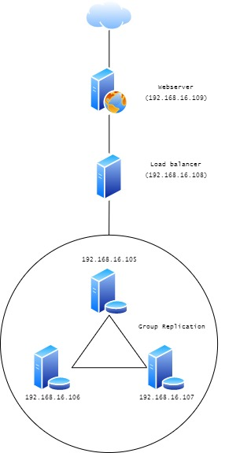
    * Spesifikasi server
      * Server Database - 3 unit
        * (192.168.16.105, 192.168.16.106, 192.168.16.107 )
        * OS: Ubuntu 16.04 (provisioning using bento/ubuntu-16.04)
        * RAM 512 MB
        * Database: MySQL
      * Load-balancer - 1 unit
        * 192.168.16.108
        * OS: Ubuntu 16.04 (provisioning using bento/ubuntu-16.04)
        * RAM 512 MB
        * Database: MySQL with ProxySQL
      * Webserver - 1 unit
        * 192.168.16.109
        * OS: Ubuntu 16.04 (provisioning using bento/ubuntu-16.04)
        * RAM 512 MB
        * Webserver: NGINX dengan PHP


  * Implementasi infrastruktur basis data terdistribusi
    * Proses instalasi
      
      Sebelum melakukan instalasi, kita perlu melakukan instalasi [Vagrant](https://www.vagrantup.com/) terlebih dahulu untuk membantu kita melakukan *provisioning*.

      Untuk melakukan proses instalasi dan konfigurasi basis data terdistribusi, terdapat beberapa tahapan yang mencakup instalasi basis data MySQL, instalasi ProxySQL, serta instalasi aplikasi web. [Konfigurasi dasar](https://drive.google.com/file/d/139l-L86LrEh45PBPchKuQGPNVMKYNYM1/view) telah diberikan oleh dosen pengajar, sehingga hanya perlu mengubah dari konfigurasi tersebut. 

      1. Instalasi dan konfigurasi basis data terdistribusi

          Pertama kita akan melakukan `vagrant up` untuk melakukan instalasi dan provisioning. Kemudian setelah semua selesai terinstall, maka kita akan melakukan `vagrant ssh [nama VM]` untuk mengakses VM yang sudah kita buat.

          Berikut adalah potongan konfigurasi dari [Vagrantfile](/ETS/Vagrantfile) untuk instalasi database.

          ```ruby
          # MySQL Cluster dengan 3 node
          (1..3).each do |i|
            config.vm.define "db#{i}" do |node|
              node.vm.hostname = "db#{i}"
              node.vm.box = "bento/ubuntu-16.04"
              node.vm.network "private_network", ip: "192.168.16.#{104+i}"
              
              node.vm.provider "virtualbox" do |vb|
                vb.name = "db#{i}"
                vb.gui = false
                vb.memory = "512"
              end
          
              node.vm.provision "shell", path: "deployMySQL1#{i}.sh", privileged: false
            end
          end
          ```

          Berikut adalah file konfigurasi untuk konfigurasi database yang digunakan sebagai [*bootstrap*](/ETS/deployMySQL11.sh) dan sebagai [*member*](/ETS/deployMySQL12.sh). Terdapat penambahan script untuk konfigurasi group replication MySQL dibawah.

          ```bash
          # Changing the APT sources.list to kambing.ui.ac.id
          sudo cp '/vagrant/sources.list' '/etc/apt/sources.list'

          # Updating the repo with the new sources
          sudo apt-get update -y

          # Install required library
          sudo apt-get install libaio1
          sudo apt-get install libmecab2

          # Get MySQL binaries
          curl -OL https://dev.mysql.com/get/Downloads/MySQL-5.7/mysql-common_5.7.23-1ubuntu16.04_amd64.deb
          curl -OL https://dev.mysql.com/get/Downloads/MySQL-5.7/mysql-community-client_5.7.23-1ubuntu16.04_amd64.deb
          curl -OL https://dev.mysql.com/get/Downloads/MySQL-5.7/mysql-client_5.7.23-1ubuntu16.04_amd64.deb
          curl -OL https://dev.mysql.com/get/Downloads/MySQL-5.7/mysql-community-server_5.7.23-1ubuntu16.04_amd64.deb

          # Setting input for installation
          sudo debconf-set-selections <<< 'mysql-community-server mysql-community-server/root-pass password admin'
          sudo debconf-set-selections <<< 'mysql-community-server mysql-community-server/re-root-pass password admin'

          # Install MySQL Community Server
          sudo dpkg -i mysql-common_5.7.23-1ubuntu16.04_amd64.deb
          sudo dpkg -i mysql-community-client_5.7.23-1ubuntu16.04_amd64.deb
          sudo dpkg -i mysql-client_5.7.23-1ubuntu16.04_amd64.deb
          sudo dpkg -i mysql-community-server_5.7.23-1ubuntu16.04_amd64.deb

          # Allow port on firewall
          sudo ufw allow 33061
          sudo ufw allow 3306

          # Copy MySQL configurations
          sudo cp /vagrant/my11.cnf /etc/mysql/my.cnf

          # Restart MySQL services
          sudo service mysql restart

          # Cluster bootstrapping untuk database pertama
          sudo mysql -u root -padmin < /vagrant/cluster_bootstrap.sql
          sudo mysql -u root -padmin < /vagrant/addition_to_sys.sql
          sudo mysql -u root -padmin < /vagrant/create_proxysql_user.sql

          # Cluster member untuk database yang lain
          sudo mysql -u root -padmin < /vagrant/cluster_member.sql
          ```

          Berikut adalah [file konfigurasi MySQL](/ETS/my11.cnf) untuk melakukan *group replication*. Adapun pengubahan yang dilakukan adalah mengubah *IP Address* yang digunakan agar sesuai dengan skema

          ```sql
          #
          # The MySQL database server configuration file.
          #
          # You can copy this to one of:
          # - "/etc/mysql/my.cnf" to set global options,
          # - "~/.my.cnf" to set user-specific options.
          # 
          # One can use all long options that the program supports.
          # Run program with --help to get a list of available options and with
          # --print-defaults to see which it would actually understand and use.
          #
          # For explanations see
          # http://dev.mysql.com/doc/mysql/en/server-system-variables.html

          #
          # * IMPORTANT: Additional settings that can override those from this file!
          #   The files must end with '.cnf', otherwise they'll be ignored.
          #

          !includedir /etc/mysql/conf.d/
          !includedir /etc/mysql/mysql.conf.d/

          [mysqld]

          # General replication settings
          gtid_mode = ON
          enforce_gtid_consistency = ON
          master_info_repository = TABLE
          relay_log_info_repository = TABLE
          binlog_checksum = NONE
          log_slave_updates = ON
          log_bin = binlog
          binlog_format = ROW
          transaction_write_set_extraction = XXHASH64
          loose-group_replication_bootstrap_group = OFF
          loose-group_replication_start_on_boot = ON
          loose-group_replication_ssl_mode = REQUIRED
          loose-group_replication_recovery_use_ssl = 1

          # Shared replication group configuration
          loose-group_replication_group_name = "8f22f846-9922-4139-b2b7-097d185a93cb"
          loose-group_replication_ip_whitelist = "192.168.16.105, 192.168.16.106, 192.168.16.107"
          loose-group_replication_group_seeds = "192.168.16.105:33061, 192.168.16.106:33061, 192.168.16.107:33061"

          # Single or Multi-primary mode? Uncomment these two lines
          # for multi-primary mode, where any host can accept writes
          loose-group_replication_single_primary_mode = OFF
          loose-group_replication_enforce_update_everywhere_checks = ON

          # Host specific replication configuration
          server_id = 11
          bind-address = "192.168.16.105"
          report_host = "192.168.16.105"
          loose-group_replication_local_address = "192.168.16.105:33061"
          ```

          Berikut adalah [file konfigurasi](/ETS/cluster_bootstrap.sql) untuk melakukan *bootstrap* pada MySQL Group Replication
          ```sql
          SET SQL_LOG_BIN=0;
          CREATE USER 'repl'@'%' IDENTIFIED BY 'clusterpassword' REQUIRE SSL;
          GRANT REPLICATION SLAVE ON *.* TO 'repl'@'%';
          FLUSH PRIVILEGES;
          SET SQL_LOG_BIN=1;
          CHANGE MASTER TO MASTER_USER='repl', MASTER_PASSWORD='clusterpassword' FOR CHANNEL 'group_replication_recovery';
          INSTALL PLUGIN group_replication SONAME 'group_replication.so';

          SET GLOBAL group_replication_bootstrap_group=ON;
          START GROUP_REPLICATION;
          SET GLOBAL group_replication_bootstrap_group=OFF;

          CREATE DATABASE reservasi;
          ```

          Berikut adalah [file konfigurasi](/ETS/cluster_member.sql) untuk menambah *member* pada MySQL Group Replication.
          ```sql
          SET SQL_LOG_BIN=0;
          CREATE USER 'repl'@'%' IDENTIFIED BY 'clusterpassword' REQUIRE SSL;
          GRANT REPLICATION SLAVE ON *.* TO 'repl'@'%';
          FLUSH PRIVILEGES;
          SET SQL_LOG_BIN=1;
          CHANGE MASTER TO MASTER_USER='repl', MASTER_PASSWORD='clusterpassword' FOR CHANNEL 'group_replication_recovery';
          INSTALL PLUGIN group_replication SONAME 'group_replication.so';
          ```

          Berikut adalah screenshoot setelah semua konfigurasi berhasil. Command yang dijalankan adalah `SELECT * FROM performance_schema.replication_group_members;` pada MySQL console untuk melihat hasil konfigurasi.

          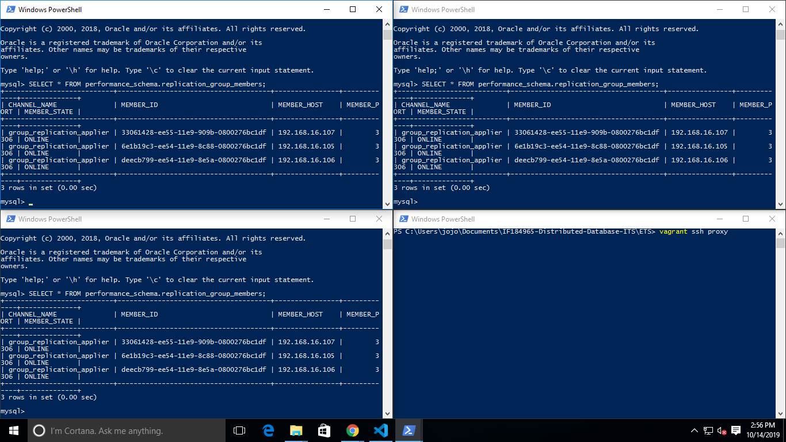

      2. Instalasi dan konfigurasi ProxySQL
        
          Berikut adalah potongan konfigurasi dari [Vagrantfile](/ETS/Vagrantfile) untuk instalasi ProxySQL.

            ```ruby
            config.vm.define "proxy" do |proxy|
              proxy.vm.hostname = "proxy"
              proxy.vm.box = "bento/ubuntu-16.04"
              proxy.vm.network "private_network", ip: "192.168.16.108"
              #proxy.vm.network "public_network",  bridge: "Ethernet 2"
              
              proxy.vm.provider "virtualbox" do |vb|
                vb.name = "proxy"
                vb.gui = false
                vb.memory = "512"
              end

              proxy.vm.provision "shell", path: "deployProxySQL.sh", privileged: false
            end
            ```

            Setelah node ProxySQL berhasil dinyalakan oleh vagrant, kita perlu melakukan koneksi ke node tersebut dengan command `vagrant ssh proxy` untuk melakukan konfigurasi lanjutan.

            Kita perlu melakukan import konfigurasi untuk menyambungkan ProxySQL dengan database MySQL yang telah dilakukan group replication. File konfigurasi yang perlu di-import dengan command
            ```bash
            mysql -u admin -padmin -h 127.0.0.1 -P 6032 < /vagrant/sql_scripts/proxysql.sql
            ```
            adalah sebagai berikut.
            ```sql
            UPDATE global_variables SET variable_value='admin:password' WHERE variable_name='admin-admin_credentials';
            LOAD ADMIN VARIABLES TO RUNTIME;
            SAVE ADMIN VARIABLES TO DISK;

            UPDATE global_variables SET variable_value='monitor' WHERE variable_name='mysql-monitor_username';
            LOAD MYSQL VARIABLES TO RUNTIME;
            SAVE MYSQL VARIABLES TO DISK;

            INSERT INTO mysql_group_replication_hostgroups (writer_hostgroup, backup_writer_hostgroup, reader_hostgroup, offline_hostgroup, active, max_writers, writer_is_also_reader, max_transactions_behind) VALUES (2, 4, 3, 1, 1, 3, 1, 100);

            INSERT INTO mysql_servers(hostgroup_id, hostname, port) VALUES (2, '192.168.16.105', 3306);
            INSERT INTO mysql_servers(hostgroup_id, hostname, port) VALUES (2, '192.168.16.106', 3306);
            INSERT INTO mysql_servers(hostgroup_id, hostname, port) VALUES (2, '192.168.16.107', 3306);

            LOAD MYSQL SERVERS TO RUNTIME;
            SAVE MYSQL SERVERS TO DISK;

            INSERT INTO mysql_users(username, password, default_hostgroup) VALUES ('reservasiuser', 'reservasipassword', 2);
            LOAD MYSQL USERS TO RUNTIME;
            SAVE MYSQL USERS TO DISK;
            ```

            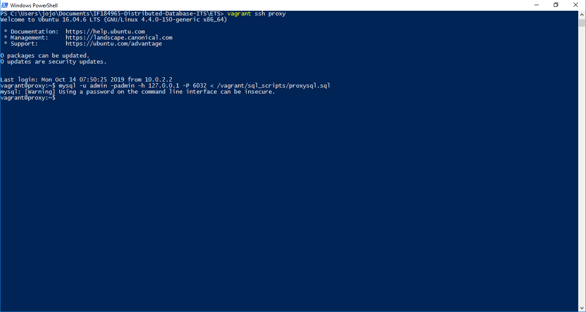

            Konfigurasi diatas adalah konfigurasi untuk menyambungkan ProxySQL dengan MySQL. Adapun user yang digunakan untuk tugas ini adalah `reservasiuser` dengan password `reservasipassword`.

      3. Instalasi dan konfigurasi Webserver
          
          Pertama kita perlu melakukan `vagrant up webserver`. Hal ini dilakukan untuk membuat VM yang berisi aplikasi webserver serta melakukan *provisioning* awal untuk mengatur webserver dan aplikasi. Hal-hal yang dilakukan saat *provisioning* adalah menginstall NGINX, PHP, serta Composer.

          Berikut adalah [potongan kode](/configuration/deployWebserver.sh) untuk melakukan *provisioning*.

          ```bash
          # Changing the APT sources.list to kambing.ui.ac.id
          sudo cp '/vagrant/configuration/sources.list' '/etc/apt/sources.list'

          sudo apt-get install software-properties-common -y
          sudo add-apt-repository ppa:ondrej/php -y

          # Updating the repo with the new sources
          sudo apt-get update -y

          sudo apt install nginx php7.2-fpm php7.2-common php7.2-mbstring php7.2-xmlrpc php7.2-soap php7.2-gd php7.2-xml php7.2-intl php7.2-mysql php7.2-cli php7.2-zip php7.2-curl -y

          sudo cp /vagrant/webserver_config/default /etc/nginx/sites-available/default -f

          cd /tmp
          wget https://raw.githubusercontent.com/composer/getcomposer.org/76a7060ccb93902cd7576b67264ad91c8a2700e2/web/installer -O - -q | php -- --quiet
          sudo mv composer.phar /usr/local/bin/composer
          ```

2. Penggunaan basis data terdistribusi dalam aplikasi

    Aplikasi yang akan digunakan dalam tugas ini adalah [*Aplikasi Presensi*](https://github.com/jonathan-lewerissa/web-pmk-its) Persekutuan Mahasiswa Kristen ITS. Aplikasi ini digunakan untuk melakukan presensi kegiatan minggu di lingkungan PMK ITS. Tugas ini sudah menyediakan file konfigurasi .env yang dapat disalin ke direktori aplikasi presensi.

  * Instalasi dan konfigurasi aplikasi
    
    Berikut adalah potongan [*script*](/deployWebserver.sh) untuk melakukan instalasi (*clone project*) dan konfigurasi aplikasi.

    ```bash
    sudo cp /vagrant/webserver_config/default /etc/nginx/sites-available/default -f

    cd /tmp
    wget https://raw.githubusercontent.com/composer/getcomposer.org/76a7060ccb93902cd7576b67264ad91c8a2700e2/web/installer -O - -q | php -- --quiet
    sudo mv composer.phar /usr/local/bin/composer

    cd ~
    git clone https://github.com/jonathan-lewerissa/web-pmk-its.git
    cd ~/web-pmk-its
    cp /vagrant/webserver_config/.env.deploy /home/vagrant/web-pmk-its/.env
    composer install

    php artisan key:generate

    sudo chown -R $USER:www-data storage
    sudo chown $USER:www-data storage/logs/laravel.log
    sudo chown -R $USER:www-data bootstrap/cache

    sudo chmod -R 775 storage
    sudo chmod 775 storage/logs/laravel.log
    sudo chmod -R 775 bootstrap/cache
    ```

    Kemudian, konfigurasi database yang berkaitan dengan aplikasi terdapat pada file [.env](/webserver_config/.env.deploy) dimana parameter database diubah konfigurasinya.
    ```
    DB_CONNECTION=mysql
    DB_HOST=192.168.16.108
    DB_PORT=6033
    DB_DATABASE=reservasi
    DB_USERNAME=reservasiuser
    DB_PASSWORD=reservasipassword

    FRONTDB_CONNECTION=mysql
    FRONTDB_HOST=192.168.16.108
    FRONTDB_PORT=6033
    FRONTDB_DATABASE=reservasi
    FRONTDB_USERNAME=reservasiuser
    FRONTDB_PASSWORD=reservasipassword
    ```

    Kemudian, ditemukan error yang berkaitan dengan aplikasi, dimana aplikasi tidak dapat membaca *foreign-key* pada database, sehingga parameter *foreign-key* dihapus secara manual pada *database*.

    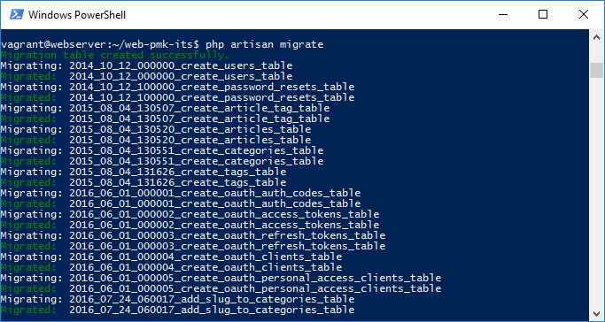

    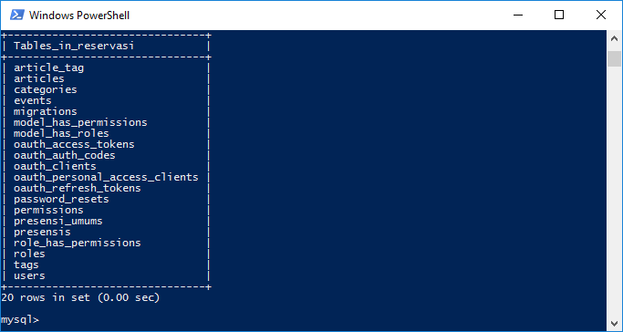

    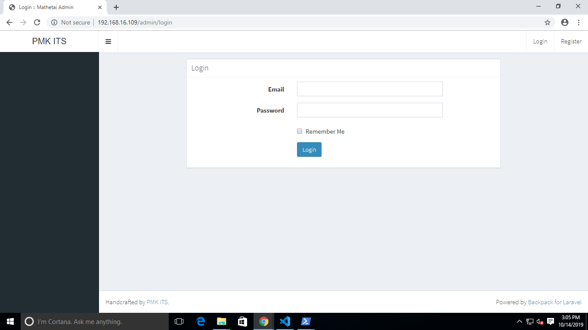
    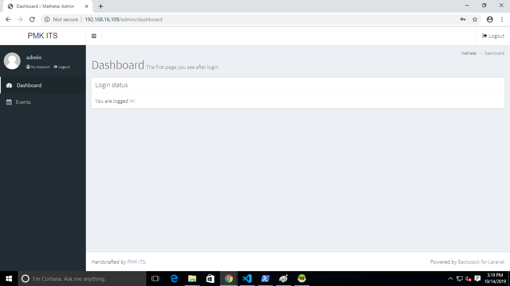

3. Simulasi Fail-over

Pada simulasi failover, pertama saya melakukan presensi untuk satu orang. Data tersebut kemudian masuk ke semua database.

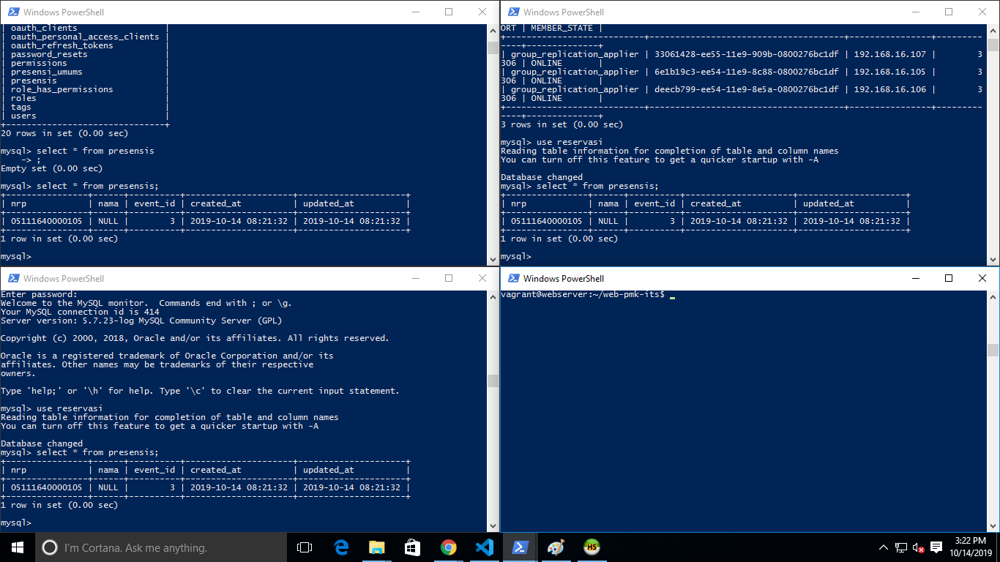

Kemudian, saya mematikan sebuah node, dalam kasus ini node DB2.

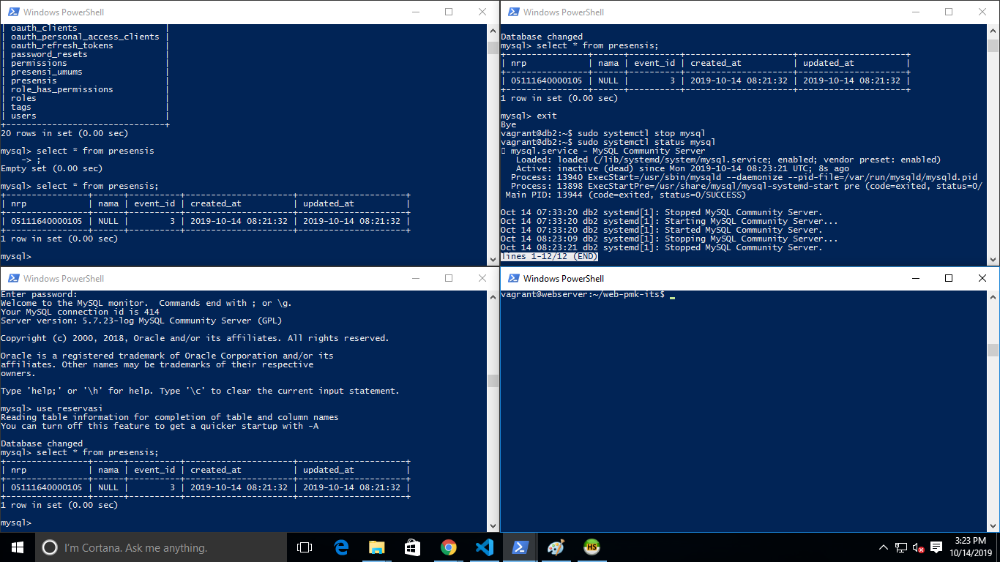

Kemudian, saya melakukan penambahan presensi baru.


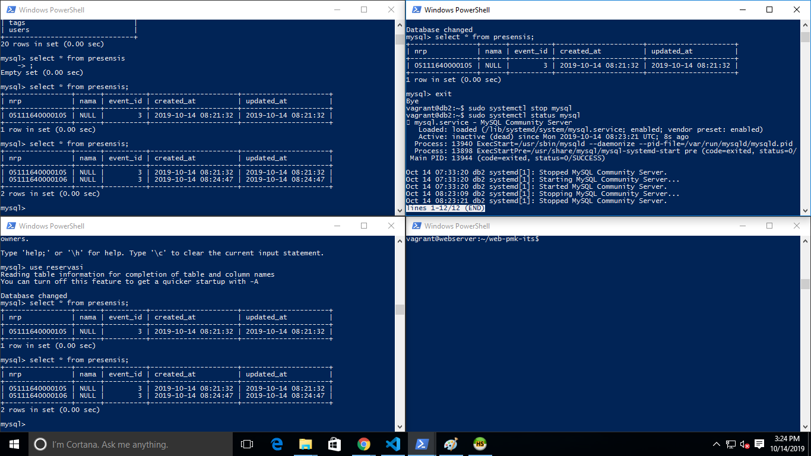

Setelah itu, saya menghidupkan kembali node DB2, kemudian melakukan query

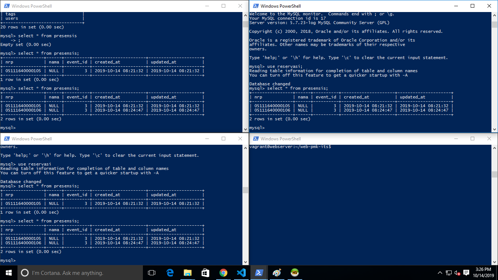


1. Referensi

    MySQL Replication:
    * https://www.digitalocean.com/community/tutorials/how-to-configure-mysql-group-replication-on-ubuntu-16-04
    * https://dev.mysql.com/doc/refman/5.7/en/group-replication.html

    ProxySQL:
    * https://www.digitalocean.com/community/tutorials/how-to-use-proxysql-as-a-load-balancer-for-mysql-on-ubuntu-16-04