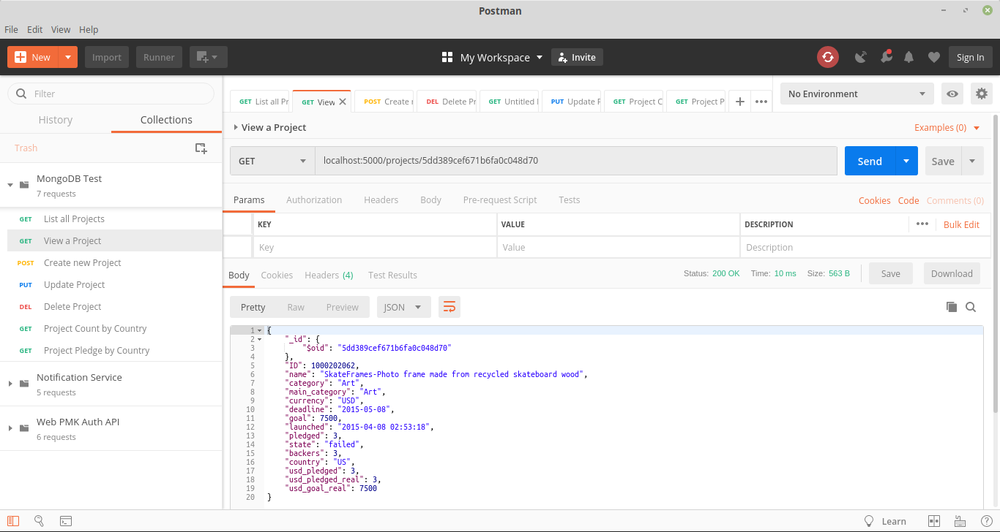

# Tugas Implementasi MongoDB Cluster

Jonathan Rehuel Lewerissa - 05111640000105

## Deskripsi Tugas
1. Implementasi Cluster MongoDB
   - Menggunakan MongoDB versi 4.2
   - Dapat menggunakan Vagrant/Docker
   - Cluster terdiri dari:
     - Config server: 2
     - Data/shard server: 3
     - Query router: 1
2. Menggunakan dataset
   - Menggunakan dataset berformat CSV atau JSON dengan ukuran > 1000 baris
   - Import ke dalam server MongoDB
3. Implementasi aplikasi CRUD
   - Menggunakan bahasa pemrograman yang support dengan connector MongoDB
   - Menggunakan Web/API/Scripting
   - Harus ada operasi CRUD
   - Untuk proses read, harus melibatkan juga agregasi
     - Minimal ada 2 contoh query agregasi

## Implementasi MongoDB Cluster
1. Spesifikasi Server
   
   Semua server yang digunakan pada tugas ini menggunakan OS `ubuntu-18.04` dengan RAM `512 MB`. Server-server ini dibagi menjadi tiga jenis, yaitu config cluster (atas), query router (tengah), dan shard cluster (bawah). Adapun pembagian server IP adalah sebagai berikut
   
   

2. Implementasi Vagrant
   
   Berikut adalah [`Vagrantfile`](Vagrantfile) yang digunakan untuk melakukan pembuatan VM

    ```ruby
    # -*- mode: ruby -*-
    # vi: set ft=ruby :

    Vagrant.configure("2") do |config|

    config.vm.define "mongo_config_1" do |mongo_config_1|
        mongo_config_1.vm.hostname = "mongo-config-1"
        mongo_config_1.vm.box = "bento/ubuntu-18.04"
        mongo_config_1.vm.network "private_network", ip: "192.168.33.11"
        
        mongo_config_1.vm.provider "virtualbox" do |vb|
        vb.name = "mongo-config-1"
        vb.gui = false
        vb.memory = "512"
        end

        mongo_config_1.vm.provision "shell", path: "provision/allhosts.sh", privileged: false
    end

    config.vm.define "mongo_config_2" do |mongo_config_2|
        mongo_config_2.vm.hostname = "mongo-config-2"
        mongo_config_2.vm.box = "bento/ubuntu-18.04"
        mongo_config_2.vm.network "private_network", ip: "192.168.33.12"
        
        mongo_config_2.vm.provider "virtualbox" do |vb|
        vb.name = "mongo-config-2"
        vb.gui = false
        vb.memory = "512"
        end

        mongo_config_2.vm.provision "shell", path: "provision/allhosts.sh", privileged: false
    end

    config.vm.define "mongo_query_router" do |mongo_query_router|
        mongo_query_router.vm.hostname = "mongo-query-router"
        mongo_query_router.vm.box = "bento/ubuntu-18.04"
        mongo_query_router.vm.network "private_network", ip: "192.168.33.21"
        
        mongo_query_router.vm.provider "virtualbox" do |vb|
        vb.name = "mongo-query-router"
        vb.gui = false
        vb.memory = "512"
        end

        mongo_query_router.vm.provision "shell", path: "provision/allhosts.sh", privileged: false
    end

    config.vm.define "mongo_shard_1" do |mongo_shard_1|
        mongo_shard_1.vm.hostname = "mongo-shard-1"
        mongo_shard_1.vm.box = "bento/ubuntu-18.04"
        mongo_shard_1.vm.network "private_network", ip: "192.168.33.31"
            
        mongo_shard_1.vm.provider "virtualbox" do |vb|
        vb.name = "mongo-shard-1"
        vb.gui = false
        vb.memory = "512"
        end

        mongo_shard_1.vm.provision "shell", path: "provision/allhosts.sh", privileged: false
    end

    config.vm.define "mongo_shard_2" do |mongo_shard_2|
        mongo_shard_2.vm.hostname = "mongo-shard-2"
        mongo_shard_2.vm.box = "bento/ubuntu-18.04"
        mongo_shard_2.vm.network "private_network", ip: "192.168.33.32"
        
        mongo_shard_2.vm.provider "virtualbox" do |vb|
        vb.name = "mongo-shard-2"
        vb.gui = false
        vb.memory = "512"
        end

        mongo_shard_2.vm.provision "shell", path: "provision/allhosts.sh", privileged: false
    end

    config.vm.define "mongo_shard_3" do |mongo_shard_3|
        mongo_shard_3.vm.hostname = "mongo-shard-3"
        mongo_shard_3.vm.box = "bento/ubuntu-18.04"
        mongo_shard_3.vm.network "private_network", ip: "192.168.33.33"
        
        mongo_shard_3.vm.provider "virtualbox" do |vb|
        vb.name = "mongo-shard-3"
        vb.gui = false
        vb.memory = "512"
        end

        mongo_shard_3.vm.provision "shell", path: "provision/allhosts.sh", privileged: false
    end

    end
    ``` 

3. Provisioning
   
   Berikut ini adalah [file](provision/allhosts.sh) yang digunakan untuk proses provisioning awal, yaitu instalasi MongoDB.

    ```bash
    # Add hostname
    sudo cp /vagrant/sources/hosts /etc/hosts

    # Copy APT sources list
    sudo cp /vagrant/sources/sources.list /etc/apt/
    sudo cp /vagrant/sources/mongodb-org-4.2.list /etc/apt/sources.list.d/

    # Add MongoDB repo key
    sudo apt-get install gnupg
    wget -qO - https://www.mongodb.org/static/pgp/server-4.2.asc | sudo apt-key add -

    # Update Repository
    sudo apt-get update
    # sudo apt-get upgrade -y

    # Install MongoDB
    sudo apt-get install -y mongodb-org

    sudo mkdir /opt/mongo
    sudo cp /vagrant/sources/mongo-keyfile /opt/mongo
    sudo chmod 400 /opt/mongo/mongo-keyfile
    sudo chown mongodb:mongodb /opt/mongo/mongo-keyfile

    # Start MongoDB
    sudo service mongod start

    if [[ $(hostname) == "mongo-config-1" ]]; then
        sudo cp /vagrant/config/mongod-config-1.conf /etc/mongod.conf
        sudo service mongod restart
    fi

    if [[ $(hostname) == "mongo-config-2" ]]; then
        sudo cp /vagrant/config/mongod-config-2.conf /etc/mongod.conf
        sudo service mongod restart
    fi

    if [[ $(hostname) == "mongo-query-router" ]]; then
        sudo service mongod stop

        sudo cp /vagrant/config/mongos-query-router.conf /etc/mongos.conf
        sudo cp /vagrant/sources/mongos.service /lib/systemd/system/mongos.service

        sudo systemctl enable mongos.service
        sudo systemctl stop mongos
    fi

    if [[ $(hostname) == "mongo-shard-1" ]]; then
        sudo cp /vagrant/config/mongo-shard-1.conf /etc/mongod.conf
        sudo service mongod restart
    fi

    if [[ $(hostname) == "mongo-shard-2" ]]; then
        sudo cp /vagrant/config/mongo-shard-2.conf /etc/mongod.conf
        sudo service mongod restart
    fi

    if [[ $(hostname) == "mongo-shard-3" ]]; then
        sudo cp /vagrant/config/mongo-shard-3.conf /etc/mongod.conf
        sudo service mongod restart
    fi
    ```
4. Konfigurasi umum
   1. [hosts](sources/hosts), digunakan untuk mendaftarkan ip address agar bisa diakses tanpa mengetikkan ip
    ```
    192.168.33.11 mongo-config-1
    192.168.33.12 mongo-config-2
    192.168.33.21 mongo-query-router
    192.168.33.31 mongo-shard-1
    192.168.33.32 mongo-shard-2
    192.168.33.33 mongo-shard-3
    ```
   2. [`mongos.service`](sources/mongos.service), digunakan untuk mendaftarkan `mongos.service` pada cluster
    ```
    [Unit]
    Description=Mongo Cluster Router
    After=network.target

    [Service]
    User=mongodb
    Group=mongodb
    ExecStart=/usr/bin/mongos --config /etc/mongos.conf
    # file size
    LimitFSIZE=infinity
    # cpu time
    LimitCPU=infinity
    # virtual memory size
    LimitAS=infinity
    # open files
    LimitNOFILE=64000
    # processes/threads
    LimitNPROC=64000
    # total threads (user+kernel)
    TasksMax=infinity
    TasksAccounting=false

    [Install]
    WantedBy=multi-user.target
    ```

5. Konfigurasi MongoDB
   
   Berikut adalah konfigurasi yang dilakukan untuk mengatur MongoDB pada cluster. 
   1. [`mongo-config-1`](config/mongod-config-1.conf)
    ```
    # mongod.conf

    # for documentation of all options, see:
    #   http://docs.mongodb.org/manual/reference/configuration-options/

    # Where and how to store data.
    storage:
    dbPath: /var/lib/mongodb
    journal:
        enabled: true
    #  engine:
    #  mmapv1:
    #  wiredTiger:

    # where to write logging data.
    systemLog:
    destination: file
    logAppend: true
    path: /var/log/mongodb/mongod.log

    # network interfaces
    net:
    port: 27019
    bindIp: 192.168.33.11


    # how the process runs
    processManagement:
    timeZoneInfo: /usr/share/zoneinfo

    # security:
    #   keyFile: /opt/mongo/mongo-keyfile

    #operationProfiling:

    replication:
    replSetName: configReplSet

    sharding:
    clusterRole: "configsvr"

    ## Enterprise-Only Options:

    #auditLog:

    #snmp:

    ```
   2. [`mongo-config-2`](config/mongod-config-2.conf)
    ```
    # mongod.conf

    # for documentation of all options, see:
    #   http://docs.mongodb.org/manual/reference/configuration-options/

    # Where and how to store data.
    storage:
    dbPath: /var/lib/mongodb
    journal:
        enabled: true
    #  engine:
    #  mmapv1:
    #  wiredTiger:

    # where to write logging data.
    systemLog:
    destination: file
    logAppend: true
    path: /var/log/mongodb/mongod.log

    # network interfaces
    net:
    port: 27019
    bindIp: 192.168.33.12


    # how the process runs
    processManagement:
    timeZoneInfo: /usr/share/zoneinfo

    # security:
    #   keyFile: /opt/mongo/mongo-keyfile

    #operationProfiling:

    replication:
    replSetName: configReplSet

    sharding:
    clusterRole: "configsvr"

    ## Enterprise-Only Options:

    #auditLog:

    #snmp:
    ```
   3. [`mongo-query-router`](config/mongos-query-router.conf)
    ```
    # where to write logging data.
    systemLog:
    destination: file
    logAppend: true
    path: /var/log/mongodb/mongos.log

    # network interfaces
    net:
    port: 27017
    bindIp: 192.168.33.21

    sharding:
    configDB: configReplSet/mongo-config-1:27019,mongo-config-2:27019
    ```
   4. [`mongo-shard-1`](config/mongo-shard-1.conf)
    ```
    # mongod.conf

    # for documentation of all options, see:
    #   http://docs.mongodb.org/manual/reference/configuration-options/

    # Where and how to store data.
    storage:
    dbPath: /var/lib/mongodb
    journal:
        enabled: true
    #  engine:
    #  mmapv1:
    #  wiredTiger:

    # where to write logging data.
    systemLog:
    destination: file
    logAppend: true
    path: /var/log/mongodb/mongod.log

    # network interfaces
    net:
    port: 27017
    bindIp: 192.168.33.31


    # how the process runs
    processManagement:
    timeZoneInfo: /usr/share/zoneinfo

    #security:

    #operationProfiling:

    #replication:

    sharding:
    clusterRole: "shardsvr"
    ## Enterprise-Only Options:

    #auditLog:

    #snmp:

    ```
   5. [`mongo-shard-2`](config/mongo-shard-2.conf)
    ```
    # mongod.conf

    # for documentation of all options, see:
    #   http://docs.mongodb.org/manual/reference/configuration-options/

    # Where and how to store data.
    storage:
    dbPath: /var/lib/mongodb
    journal:
        enabled: true
    #  engine:
    #  mmapv1:
    #  wiredTiger:

    # where to write logging data.
    systemLog:
    destination: file
    logAppend: true
    path: /var/log/mongodb/mongod.log

    # network interfaces
    net:
    port: 27017
    bindIp: 192.168.33.32


    # how the process runs
    processManagement:
    timeZoneInfo: /usr/share/zoneinfo

    #security:

    #operationProfiling:

    #replication:

    sharding:
    clusterRole: "shardsvr"
    ## Enterprise-Only Options:

    #auditLog:

    #snmp:

    ```
   6. [`mongo-shard-3`](config/mongo-shard-3.conf)
    ```
    # mongod.conf

    # for documentation of all options, see:
    #   http://docs.mongodb.org/manual/reference/configuration-options/

    # Where and how to store data.
    storage:
    dbPath: /var/lib/mongodb
    journal:
        enabled: true
    #  engine:
    #  mmapv1:
    #  wiredTiger:

    # where to write logging data.
    systemLog:
    destination: file
    logAppend: true
    path: /var/log/mongodb/mongod.log

    # network interfaces
    net:
    port: 27017
    bindIp: 192.168.33.33


    # how the process runs
    processManagement:
    timeZoneInfo: /usr/share/zoneinfo

    #security:

    #operationProfiling:

    #replication:

    sharding:
    clusterRole: "shardsvr"
    ## Enterprise-Only Options:

    #auditLog:

    #snmp:

    ```

## Konfigurasi MongoDB Cluster
1. Replica Set Configuration

    Pertama, akses salah satu server config, lalu akses mongo 
    ```bash
    vagrant ssh mongo_config_1
    mongo mongo-config-1:27019
    ```

    Kemudian, lakukan [konfigurasi replica set](provision/register-config.sh) pada dua server configuration
    ```
    rs.initiate( { _id: "configReplSet", configsvr: true, members: [ { _id: 0, host: "mongo-config-1:27019" }, { _id: 1, host: "mongo-config-2:27019" } ] } )

    rs.status()
    ```

    Kemudian, kita perlu [menambahkan user admin](provision/add-user.sh) untuk melakukan operasi pada basis data
    ```
    use admin

    db.createUser({user: "mongo-admin", pwd: "password", roles:[{role: "root", db: "admin"}]})
    ```
 
2. Query Router Configuration
   
   Konfigurasi yang perlu dilakukan pada query router adalah memastikan bahwa variabel `configDB` pada [konfigurasi](config/mongos-query-router.conf) memiliki nilai yang benar
   ```
   configDB: configReplSet/mongo-config-1:27019,mongo-config-2:27019
   ```

3. Sharding Configuration
   
   Pertama, akses query-router melalui salah satu node shard
   ```bash
   vagrant ssh mongo_shard_1

   mongo mongo-query-router:27017 -u mongo-admin -p --authenticationDatabase admin
   ```

   Kemudian, tambahkan [server shard](provision/register-shard.sh) agar diketahui oleh query router
   ```bash
   sh.addShard("mongo-shard-1:27017")
   sh.addShard("mongo-shard-2:27017")
   sh.addShard("mongo-shard-3:27017")
   ```

## Impor Data dan Uji Coba
Untuk melakukan import data, pertama kita perlu membuat database terlebih dahulu dengan konfigurasi tambahan untuk melakukan sharding
```
use kickstarter
sh.enableSharding("kickstarter")

use config
db.databases.find()

use kickstarter
db.projects.ensureIndex( {_id: "hashed"} )
sh.shardCollection("kickstarter.projects", {"_id": "hashed"})
```

Kemudian, kita melakukan import data kedalam MongoDB
```bash
mongoimport --host 192.168.33.21 --port 27017 --db kickstarter --collection projects --file /vagrant/kickstarter-projects/ks-projects-201801.csv --type csv --headerline
```

Kemudian, kita dapat melihat distribusi data dalam shard cluster dengan cara sebagai berikut:
```
use kickstarter
db.projects.getShardDistribution()
```


Untuk melakukan testing, sebuah aplikasi telah dibuat untuk melakukan CRUD pada database. Aplikasi ini dibuat menggunakan bahasa pemrograman Python dengan library Flask.

- Create
  
- Read
  
  
- Update
  
- Delete
  
- Aggregation: group count
  
- Aggregation: group maximum
  
