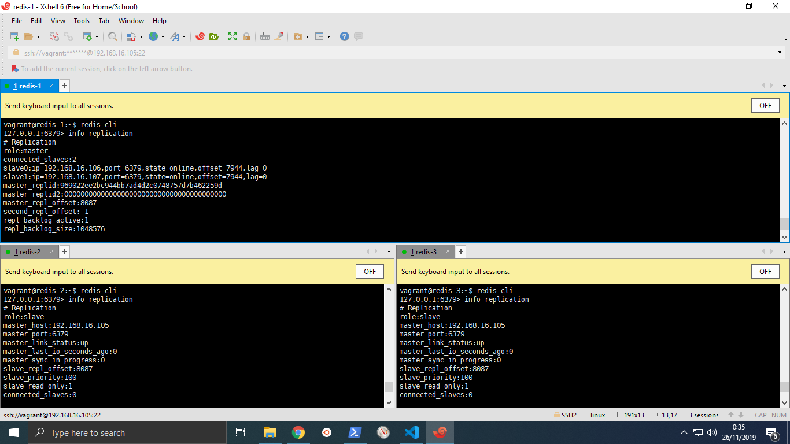
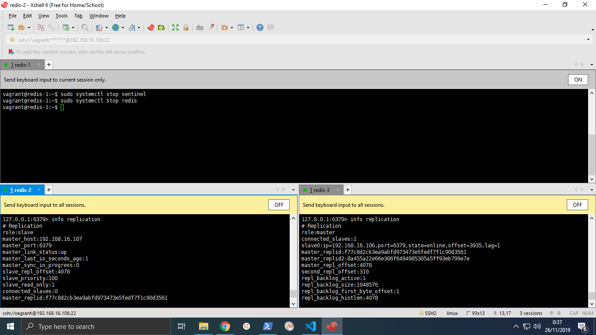
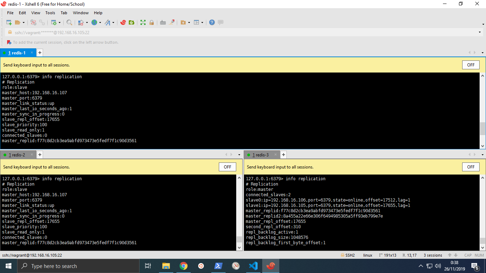

# Redis Cluster Task
Dikerjakan oleh **Jonathan Rehuel Lewerissa - 05111640000105**

## Daftar Isi
- [Redis Cluster Task](#redis-cluster-task)
  - [Daftar Isi](#daftar-isi)
  - [Deskripsi Tugas](#deskripsi-tugas)
  - [Arsitektur Sistem](#arsitektur-sistem)
  - [Implementasi](#implementasi)
    - [Vagrantfile](#vagrantfile)
    - [Redis Cluster](#redis-cluster)
    - [MySQL Database](#mysql-database)
    - [Webserver & Wordpress](#webserver--wordpress)
  - [Pengujian](#pengujian)
    - [Load Testing (JMeter)](#load-testing-jmeter)
    - [Failover Simulation](#failover-simulation)

## Deskripsi Tugas
- Buatlah sebuah cluster Redis dengan 3 buah node. Tuliskan file konfigurasi yang digunakan.

- Buatlah sebuah web server, kemudian:
  - Install Wordpress
  - Konfigurasi Wordpress agar menggunakan Redis cache

- Buatlah sebuah web server lagi dengan konfigurasi hardware yang sama, kemudian install Wordpress. Pada server ini tidak perlu mengaktifkan Redis cache

- Lakukan pengujian menggunakan JMeter untuk mengecek perbedaan load time dari dua server web tersebut. Buat kesimpulan dari pengujian yang telah dilakukan.

- Lakukan pula pengujian untuk menunjukkan bahwa proses fail over menggunakan Redis Sentinel berhasil. Caranya dengan mematikan salah satu server Redis dan mengecek siapa master node baru yang terpilih.

## Arsitektur Sistem
Artistektur sistem yang digunakan pada tugas ini terdiri dari tiga buah *cache server* menggunakan Redis, sebuah server basis data menggunakan MySQL, serta sebuah webserver (nginx) yang menjalankan Wordpress.

## Implementasi

### Vagrantfile
Berikut adalah implementasi [`Vagrantfile`](Vagrantfile) untuk melakukan instalasi server.

```ruby
# -*- mode: ruby -*-
# vi: set ft=ruby :

# All Vagrant configuration is done below. The "2" in Vagrant.configure
# configures the configuration version (we support older styles for
# backwards compatibility). Please don't change it unless you know what
# you're doing.

Vagrant.configure("2") do |config|

  (1..3).each do |i|
    config.vm.define "redis-#{i}" do |node|
      node.vm.hostname = "redis-#{i}"
      node.vm.box = "bento/ubuntu-18.04"
      node.vm.network "private_network", ip: "192.168.16.#{104+i}"
      
      node.vm.provider "virtualbox" do |vb|
        vb.name = "redis-#{i}"
        vb.gui = false
        vb.memory = "512"
      end
  
      node.vm.provision "shell", path: "provision/provision-redis.sh", privileged: false
    end
  end

  config.vm.define "mysql-db" do |proxy|
    proxy.vm.hostname = "mysql-db"
    proxy.vm.box = "bento/ubuntu-18.04"
    proxy.vm.network "private_network", ip: "192.168.16.108"
    
    proxy.vm.provider "virtualbox" do |vb|
      vb.name = "mysql-db"
      vb.gui = false
      vb.memory = "512"
    end

    proxy.vm.provision "shell", path: "provision/provision-mysql.sh", privileged: false
  end

end
```

### Redis Cluster
- Provision Script
  Berikut adalah [*provisioning script*](provision/provision-redis.sh) untuk seluruh node Redis. Script ini berfungsi untuk melakukan instalasi Redis.
    ```bash
    # Add hostname
    sudo cp /vagrant/sources/hosts /etc/hosts

    # Copy APT sources list
    sudo cp /vagrant/sources/sources.list /etc/apt/

    # Update Repository
    sudo apt-get update
    sudo apt-get install build-essential tcl libjemalloc-dev -y
    # sudo apt-get upgrade -y

    # Create user for Redis
    sudo adduser --system --group --no-create-home redis
    sudo mkdir /var/lib/redis
    sudo chown redis:redis /var/lib/redis
    sudo chmod 770 /var/lib/redis

    # Install Redis
    sudo cp /vagrant/sources/redis-stable.tar.gz /home/vagrant
    tar xvzf redis-stable.tar.gz
    cd redis-stable
    make
    sudo make install

    sudo cp /vagrant/service/redis.service /lib/systemd/system
    sudo cp /vagrant/service/sentinel.service /lib/systemd/system

    sudo systemctl enable redis.service
    sudo systemctl enable sentinel.service

    sudo mkdir /etc/redis

    if [[ $(hostname) == "redis-1" ]]; then
        sudo cp /vagrant/configuration/redis-master.conf /etc/redis/redis.conf
    else
        sudo cp /vagrant/configuration/redis-slave.conf /etc/redis/redis.conf
    fi

    sudo cp /vagrant/configuration/sentinel.conf /etc/redis/

    sudo chown redis:redis /etc/redis/ -R
    sudo chmod 775 /etc/redis/

    sudo mkdir /opt/redis
    sudo mkdir /opt/redis/redis-stable
    sudo chmod 775 /opt/redis/redis-stable -R
    sudo chown redis:redis /opt/redis/redis-stable -R
    ```

- `redis.conf`
  
  Terdapat dua jenis file `redis.conf`, yaitu untuk [node master](configuration/redis-master.conf) dan [node slave](configuration/redis-slave.conf), dimana perbedaan yang ada adalah penambahan `slaveof 192.168.16.105 6379` pada slave untuk menunjukkan node yang merupakan master.

  - [`redis-master.conf`](configuration/redis-master.conf)
    ```bash
    protected-mode no
    # bind 127.0.0.1
    port 6379
    # supervised systemd

    save 900 1
    save 300 10
    save 60 10000

    stop-writes-on-bgsave-error yes
    rdbcompression yes
    rdbchecksum yes
    dbfilename dump.rdb
    dir /var/lib/redis

    # logfile "/opt/redis/redis-server/redis.log"
    ```
  - [`redis-slave.conf`](configuration/redis-slave.conf)
    ```bash
    protected-mode no
    # bind 127.0.0.1
    port 6379
    # supervised systemd

    save 900 1
    save 300 10
    save 60 10000

    stop-writes-on-bgsave-error yes
    rdbcompression yes
    rdbchecksum yes
    dbfilename dump.rdb
    dir /var/lib/redis

    # logfile "/opt/redis/redis-server/redis.log"
    slaveof 192.168.16.105 6379
    ```

- [`sentinel.conf`](configuration/sentinel.conf)
    
    Berikut adalah file konfigurasi untuk [`sentinel.conf`](configuration/sentinel.conf)

    ```bash
    protected-mode no
    port 26379

    sentinel monitor mymaster 192.168.16.105 6379 2
    sentinel down-after-milliseconds mymaster 5000
    sentinel failover-timeout mymaster 10000

    # logfile "/opt/redis/redis-server/sentinel.log"
    ```
- Eksekusi program
  
  Untuk menjalankan Redis server dan Sentinel, kita cukup melakukan dua command, yaitu
  ```bash
  sudo systemctl start redis
  sudo systemctl start sentinel
  ```

### MySQL Database
- Provisioning Script

    Berikut adalah provisioning script untuk melakukan instalasi MySQL serta membuat user & database pada server

    ```bash
    sudo cp /vagrant/sources/sources.list /etc/apt/

    # Updating the repo with the new sources
    sudo apt-get update -y

    # Install required library
    sudo apt-get install libaio1
    sudo apt-get install libmecab2

    # Get MySQL binaries
    curl -OL https://dev.mysql.com/get/Downloads/MySQL-5.7/mysql-common_5.7.23-1ubuntu16.04_amd64.deb
    curl -OL https://dev.mysql.com/get/Downloads/MySQL-5.7/mysql-community-client_5.7.23-1ubuntu16.04_amd64.deb
    curl -OL https://dev.mysql.com/get/Downloads/MySQL-5.7/mysql-client_5.7.23-1ubuntu16.04_amd64.deb
    curl -OL https://dev.mysql.com/get/Downloads/MySQL-5.7/mysql-community-server_5.7.23-1ubuntu16.04_amd64.deb

    # Setting input for installation
    sudo debconf-set-selections <<< 'mysql-community-server mysql-community-server/root-pass password admin'
    sudo debconf-set-selections <<< 'mysql-community-server mysql-community-server/re-root-pass password admin'

    # Install MySQL Community Server
    sudo dpkg -i mysql-common_5.7.23-1ubuntu16.04_amd64.deb
    sudo dpkg -i mysql-community-client_5.7.23-1ubuntu16.04_amd64.deb
    sudo dpkg -i mysql-client_5.7.23-1ubuntu16.04_amd64.deb
    sudo dpkg -i mysql-community-server_5.7.23-1ubuntu16.04_amd64.deb

    # Allow port on firewall
    sudo ufw allow 33061
    sudo ufw allow 3306

    # Restart MySQL services
    sudo service mysql restart

    # Create Database and User
    sudo bash /vagrant/provision/mysql-create-user.sh wordpressDB wordpress-user wordpress-password
    sudo bash /vagrant/provision/mysql-create-user.sh wordpressRedis wordpress-user wordpress-password
    ```
### Webserver & Wordpress
Webserver yang digunakan dijalankan pada host, sehingga instalasi dan konfigurasi yang dilakukan adalah melakukan instalasi webserver menggunakan [Laragon](https://laragon.org/), mengunduh [file Wordpress](https://wordpress.org/download/), melakukan ekstraksi, kemudian melakukan konfigurasi pada Wordpress. Terdapat dua jenis web yang digunakan pada tugas ini, yaitu web yang menggunakan basis data MySQL saja serta web yang menggunakan Redis sebagai Object Cache Server.

Yang juga perlu diperhatikan adalah pengaturan pada Wordpress yang menggunakan Redis Object Cache. Terdapat penambahan konfigurasi pada wp-config.php, yaitu
```php
define( 'WP_REDIS_CLIENT', 'predis' );
define( 'WP_REDIS_SENTINEL', 'mymaster' );
define( 'WP_REDIS_TIMEOUT', 5 );
define( 'WP_REDIS_READ_TIMEOUT', 5 );
define( 'WP_REDIS_SERVERS', [
    'tcp://192.168.16.105:26379',
	'tcp://192.168.16.106:26379',
	'tcp://192.168.16.107:26379',
] );
```
Pastikan untuk menambahkan konfigurasi tersebut sebelum bagian khusus developer.

## Pengujian

### Load Testing (JMeter)

### Failover Simulation
Pada simulasi ini, yang pertama kali dilakukan adalah membuka `redis-cli`, kemudian memastikan bahwa server Redis master berada di `192.168.16.105`



Kemudian, kita akan mematikan node master, kemudian memeriksa pada node lain serta memastikan bahwa master sudah berubah posisinya, dalam kasus ini berpindah pada `192.168.16.107`.



Setelah memastikan master berubah, sekarang kita menyalakan lagi server `192.168.16.105` serta memastikan perubahan statusnya menjadi slave.

