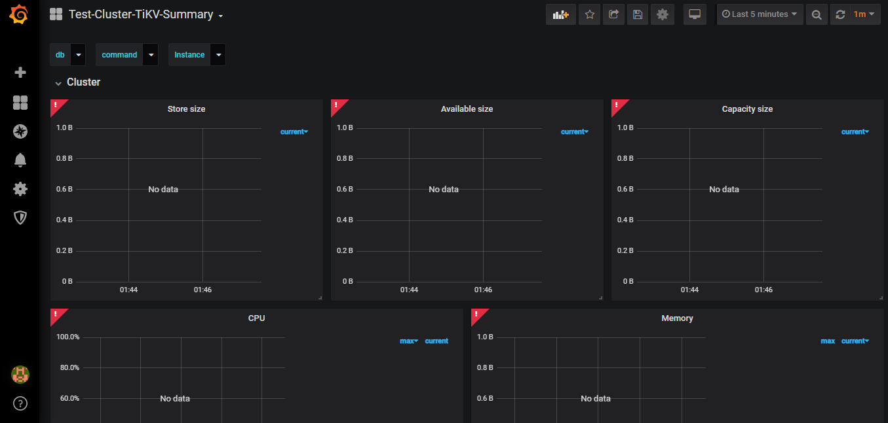

# EAS Basis Data Terdistribusi
Jonathan Rehuel Lewerissa
05111640000105

- [EAS Basis Data Terdistribusi](#eas-basis-data-terdistribusi)
  - [Deskripsi Tugas](#deskripsi-tugas)
  - [Desain dan Implementasi Arsitektur TiDB](#desain-dan-implementasi-arsitektur-tidb)
    - [Desain Arsitektur TiDB](#desain-arsitektur-tidb)
    - [Implementasi TiDB](#implementasi-tidb)
  - [Pemanfaatan Basis Data Terdistribusi dalam Aplikasi](#pemanfaatan-basis-data-terdistribusi-dalam-aplikasi)
  - [Uji Performa Aplikasi dan Basis Data](#uji-performa-aplikasi-dan-basis-data)
    - [Uji Performa JMeter](#uji-performa-jmeter)
    - [Uji Performa Sysbench](#uji-performa-sysbench)
    - [Uji Fail-over](#uji-fail-over)
  - [Monitoring Basis Data](#monitoring-basis-data)
    - [Instalasi](#instalasi)
    - [Konfigurasi Grafana](#konfigurasi-grafana)

## Deskripsi Tugas

Tugas ini merupakan sebuah implementasi basis data terdistribusi menggunakan TiDB. Aplikasi yang akan digunakan pada tugas ini adalah aplikasi CRUD berbasis Laravel. Pengujian yang dilakukan meliputi pengujian menggunakan JMeter, Sysbench, dan uji coba fail-over. Tugas ini juga akan menggunakan tools monitoring menggunakan Grafana dan Prometheus.

## Desain dan Implementasi Arsitektur TiDB

### Desain Arsitektur TiDB


| | node-1 | node-2 | node-3 | node-4 | node-5 | node-6 |
|:---:|:---:|:---:|:---:|:---:|:---:|:---:|
| Plugin | PD, TiDB, node_export, Prometheus, Grafana | PD, node_export | PD, node_export | TiKV, node_export | TiKV, node_export | TiKV, node_export |
| OS | CentOS 7 | CentOS 7 | CentOS 7 | CentOS 7 | CentOS 7 | CentOS 7 |
| RAM | `512` MB | `512` MB | `512` MB | `512` MB | `512` MB | `512` MB |
| IP | 192.168.16.105 | 192.168.16.106 | 192.168.16.107 | 192.168.16.108 | 192.168.16.109 | 192.168.16.110 |

### Implementasi TiDB

* Menjalankan TiDB
  * Menjalankan Placement Driver
    
    Placement Driver Server (`pd-server`) akan dijalankan pada `node-1`, `node-2`, dan `node-3`. 
    
    Untuk menjalankan `pd-server` pada `node-1`, command yang dijalankan adalah
    ```
    ./tidb-v3.0-linux-amd64/bin/pd-server --name=pd1 \
                --data-dir=pd \
                --client-urls="http://192.168.16.105:2379" \
                --peer-urls="http://192.168.16.105:2380" \
                --initial-cluster="pd1=http://192.168.16.105:2380,pd2=http://192.168.16.106:2380,pd3=http://192.168.16.107:2380" \
                --log-file=pd.log &
    ```

    Untuk menjalankan `pd-server` pada `node-2`, command yang dijalankan adalah
    ```
    ./tidb-v3.0-linux-amd64/bin/pd-server --name=pd2 \
                --data-dir=pd \
                --client-urls="http://192.168.16.106:2379" \
                --peer-urls="http://192.168.16.106:2380" \
                --initial-cluster="pd1=http://192.168.16.105:2380,pd2=http://192.168.16.106:2380,pd3=http://192.168.16.107:2380" \
                --log-file=pd.log &
    ```

    Untuk menjalankan `pd-server` pada `node-3`, command yang dijalankan adalah
    ```
    ./tidb-v3.0-linux-amd64/bin/pd-server --name=pd3 \
                --data-dir=pd \
                --client-urls="http://192.168.16.107:2379" \
                --peer-urls="http://192.168.16.107:2380" \
                --initial-cluster="pd1=http://192.168.16.105:2380,pd2=http://192.168.16.106:2380,pd3=http://192.168.16.107:2380" \
                --log-file=pd.log &
    ```

  * Menjalankan TiKV Server

    TiKV Server (`tikv-server`) akan dijalankan pada `node-4`, `node-5`, dan `node-6`.

    Untuk menjalankan `tikv-server` pada `node-4`, command yang dijalankan adalah
    ```
    ./tidb-v3.0-linux-amd64/bin/tikv-server --pd="192.168.16.105:2379,192.168.16.106:2379,192.168.16.107:2379" \
                  --addr="192.168.16.108:2379" \
                  --data-dir=tikv \
                  --log-file=tikv.log &
    ```

    Untuk menjalankan `tikv-server` pada `node-5`, command yang dijalankan adalah
    ```
    ./tidb-v3.0-linux-amd64/bin/tikv-server --pd="192.168.16.105:2379,192.168.16.106:2379,192.168.16.107:2379" \
                  --addr="192.168.16.109:2379" \
                  --data-dir=tikv \
                  --log-file=tikv.log &
    ```

    Untuk menjalankan `tikv-server` pada `node-6`, command yang dijalankan adalah
    ```
    ./tidb-v3.0-linux-amd64/bin/tikv-server --pd="192.168.16.105:2379,192.168.16.106:2379,192.168.16.107:2379" \
                  --addr="192.168.16.110:2379" \
                  --data-dir=tikv \
                  --log-file=tikv.log &
    ```

  * Menjalankan TiDB Server 

    TiDB Server (`tidb-server`) akan dijalankan hanya pada `node-1`. Server ini akan berfungsi sebagai *gateway*.

    Untuk menjalankan `tidb-server` pada `node-1`, command yang dijalankan adalah
    ```
    ./tidb-v3.0-linux-amd64/bin/tidb-server --store=tikv \
                  --path="192.168.16.105:2379" \
                  --log-file=tidb.log &
    ```

* Melakukan *import* data
  
  Dataset yang akan digunakan pada tugas ini adalah [Kickstarter Projects](https://www.kaggle.com/kemical/kickstarter-projects). Adapun dataset tersebut telah saya import terlebih dahulu kedalam sebuah MySQL Database. Untuk melakukan import data, maka kita perlu melakukan backup file dari MySQL, kemudian melakukan restore data pada TiDB.

  1. Import data dari MySQL (dilakukan dari host)

    ```
    ./tidb-enterprise-tools-latest-linux-amd64/bin/mydumper -h 127.0.0.1 -P 3306 -u root -t 16 -F 64 -B test -T kickstarter --skip-tz-utc -o /vagrant/dataset-kickstarter-projects/test
    ```

  2. Restore data ke TiDB

    ```
    ./tidb-enterprise-tools-latest-linux-amd64/bin/loader -h 192.168.16.105 -u root -P 4000 -t 32 -d /vagrant/dataset-kickstarter-projects/test
    ```

## Pemanfaatan Basis Data Terdistribusi dalam Aplikasi

Aplikasi yang digunakan pada tugas ini adalah aplikasi CRUD yang dibangun menggunakan Laravel Framework. Konfigurasi aplikasi dapat dilihat di folder [`application`](application/). Aplikasi yang akan digunakan akan dijalankan pada host.

1. Index
   


2. View Single Resource
   


3. Create


4. Update


5. Delete


## Uji Performa Aplikasi dan Basis Data

### Uji Performa JMeter

Berikut adalah hasil pengujian menggunakan JMeter


### Uji Performa Sysbench

Untuk melakukan pengujian menggunakan `sysbench`, pertama kita perlu melakukan instalasi `sysbench` dan `tidb-bench`

```
curl -s https://packagecloud.io/install/repositories/akopytov/sysbench/script.rpm.sh | sudo bash
sudo yum -y install sysbench

git clone https://github.com/pingcap/tidb-bench.git
cd tidb-bench/sysbench
```

Kemudian, edit file konfigurasi yang terdapat pada `config` dan sesuaikan dengan konfigurasi TiDB.

Berikut adalah hasil pengujian sysbench dengan 3 PD Server

```
SQL statistics:
    queries performed:
        read:                            2112403
        write:                           0
        other:                           0
        total:                           2112403
    transactions:                        2112403 (7040.42 per sec.)
    queries:                             2112403 (7040.42 per sec.)
    ignored errors:                      0      (0.00 per sec.)
    reconnects:                          0      (0.00 per sec.)

General statistics:
    total time:                          300.0375s
    total number of events:              2112403

Latency (ms):
         min:                                    0.87
         avg:                                   14.20
         max:                                  148.78
         95th percentile:                       24.38
         sum:                             29995300.38

Threads fairness:
    events (avg/stddev):           21124.0300/51.50
    execution time (avg/stddev):   299.9530/0.02
```

Berikut adalah pengujian sysbench menggunakan 2 PD Server

```
SQL statistics:
    queries performed:
        read:                            2136959
        write:                           0
        other:                           0
        total:                           2136959
    transactions:                        2136959 (7122.45 per sec.)
    queries:                             2136959 (7122.45 per sec.)
    ignored errors:                      0      (0.00 per sec.)
    reconnects:                          0      (0.00 per sec.)

General statistics:
    total time:                          300.0298s
    total number of events:              2136959

Latency (ms):
         min:                                    1.03
         avg:                                   14.04
         max:                                   94.91
         95th percentile:                       24.38
         sum:                             29996372.58

Threads fairness:
    events (avg/stddev):           21369.5900/49.62
    execution time (avg/stddev):   299.9637/0.01
```

### Uji Fail-over

Pertama kita perlu menentukan *leader* dari pd-server untuk menentukan node mana yang menjadi leader dengan menjalankan command 

```
curl http://192.168.16.105:2379/pd/api/v1/members
```


Node tersebut kemudian akan dimatikan dengan cara `kill -9 <PID>`. Adapun nilai `PID` dapat dicari dengan `ps -aux | grep pd-server`

Setelah node leader dimatikan, maka coba kembali menjalankan command tersebut. Terlihat bahwa node leader sudah digantikan perannya oleh node lain.


## *Monitoring* Basis Data

### Instalasi
Untuk melakukan monitoring, pertama kita perlu menjalankan `node_exporter` pada setiap node

```
cd ~/node_exporter-0.18.1.linux-amd64
./node_exporter --web.listen-address=":9100" \
    --log.level="info" &
```

Kemudian, kita perlu melakukan instalasi Prometheus dan Grafana di `node-1`

```
wget https://github.com/prometheus/prometheus/releases/download/v2.2.1/prometheus-2.2.1.linux-amd64.tar.gz
wget https://dl.grafana.com/oss/release/grafana-6.5.1.linux-amd64.tar.gz

tar -xzf prometheus-2.2.1.linux-amd64.tar.gz
tar -zxf grafana-6.5.1.linux-amd64.tar.gz

cp /vagrant/config/prometheus.yml ~/prometheus-2.2.1.linux-amd64
cp /vagrant/config/grafana.ini ~/grafana-6.5.1/conf
```

Untuk menjalankan Prometheus, gunakan command

```
cd ~/prometheus-2.2.1.linux-amd64
./prometheus \
    --config.file="./prometheus.yml" \
    --web.listen-address=":9090" \
    --web.external-url="http://192.168.16.105:9090/" \
    --web.enable-admin-api \
    --log.level="info" \
    --storage.tsdb.path="./data.metrics" \
    --storage.tsdb.retention="15d" &
```

Untuk menjalankan Grafana, gunakan command

```
cd ~/grafana-6.5.1
./bin/grafana-server --config="./conf/grafana.ini" &
```

### Konfigurasi Grafana
1. Kunjungi `192.168.16.105:3000` dengan user|pass `admin|admin`
2. Pada bagian data-source, tambahkan Prometheus sebagai datasource dengan sumber `192.168.16.105:9090` 
3. Untuk melihat import dashboard, kita dapat menggunakan yang telah disediakan [disini](https://github.com/pingcap/tidb-ansible/tree/master/scripts). Pada tugas ini, yang akan digunakan adalah `tidb.json`, `tidb_summary.json`, dan `tikv_summary.json`.


