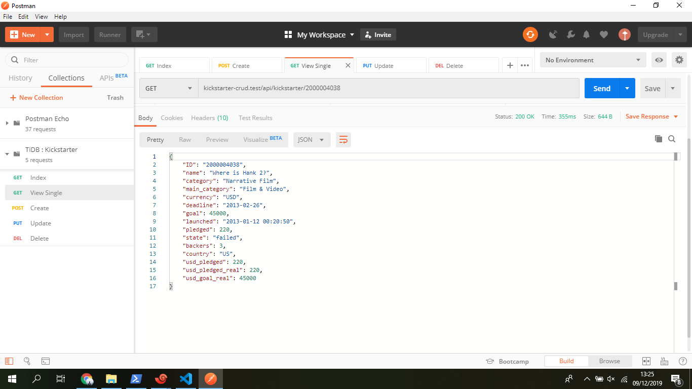

Jonathan Rehuel Lewerissa
05111640000105

## Deskripsi Tugas

## Desain dan Implementasi Arsitektur TiDB

### Desain Arsitektur TiDB

### Implementasi TiDB

* Menjalankan TiDB
  * Menjalankan Placement Driver
    
    Placement Driver Server (`pd-server`) akan dijalankan pada `node-1`, `node-2`, dan `node-3`. 
    
    Untuk menjalankan `pd-server` pada `node-1`, command yang dijalankan adalah
    ```
    ./tidb-v3.0-linux-amd64/bin/pd-server --name=pd1 \
                --data-dir=pd \
                --client-urls="http://192.168.16.105:2379" \
                --peer-urls="http://192.168.16.105:2380" \
                --initial-cluster="pd1=http://192.168.16.105:2380,pd2=http://192.168.16.106:2380,pd3=http://192.168.16.107:2380" \
                --log-file=pd.log &
    ```

    Untuk menjalankan `pd-server` pada `node-2`, command yang dijalankan adalah
    ```
    ./tidb-v3.0-linux-amd64/bin/pd-server --name=pd2 \
                --data-dir=pd \
                --client-urls="http://192.168.16.106:2379" \
                --peer-urls="http://192.168.16.106:2380" \
                --initial-cluster="pd1=http://192.168.16.105:2380,pd2=http://192.168.16.106:2380,pd3=http://192.168.16.107:2380" \
                --log-file=pd.log &
    ```

    Untuk menjalankan `pd-server` pada `node-3`, command yang dijalankan adalah
    ```
    ./tidb-v3.0-linux-amd64/bin/pd-server --name=pd3 \
                --data-dir=pd \
                --client-urls="http://192.168.16.107:2379" \
                --peer-urls="http://192.168.16.107:2380" \
                --initial-cluster="pd1=http://192.168.16.105:2380,pd2=http://192.168.16.106:2380,pd3=http://192.168.16.107:2380" \
                --log-file=pd.log &
    ```

  * Menjalankan TiKV Server

    TiKV Server (`tikv-server`) akan dijalankan pada `node-4`, `node-5`, dan `node-6`.

    Untuk menjalankan `tikv-server` pada `node-4`, command yang dijalankan adalah
    ```
    ./tidb-v3.0-linux-amd64/bin/tikv-server --pd="192.168.16.105:2379,192.168.16.106:2379,192.168.16.107:2379" \
                  --addr="192.168.16.108:2379" \
                  --data-dir=tikv \
                  --log-file=tikv.log &
    ```

    Untuk menjalankan `tikv-server` pada `node-5`, command yang dijalankan adalah
    ```
    ./tidb-v3.0-linux-amd64/bin/tikv-server --pd="192.168.16.105:2379,192.168.16.106:2379,192.168.16.107:2379" \
                  --addr="192.168.16.109:2379" \
                  --data-dir=tikv \
                  --log-file=tikv.log &
    ```

    Untuk menjalankan `tikv-server` pada `node-6`, command yang dijalankan adalah
    ```
    ./tidb-v3.0-linux-amd64/bin/tikv-server --pd="192.168.16.105:2379,192.168.16.106:2379,192.168.16.107:2379" \
                  --addr="192.168.16.110:2379" \
                  --data-dir=tikv \
                  --log-file=tikv.log &
    ```

  * Menjalankan TiDB Server 

    TiDB Server (`tidb-server`) akan dijalankan hanya pada `node-1`. Server ini akan berfungsi sebagai *gateway*.

    Untuk menjalankan `tidb-server` pada `node-1`, command yang dijalankan adalah
    ```
    ./tidb-v3.0-linux-amd64/bin/tidb-server --store=tikv \
                  --path="192.168.16.105:2379" \
                  --log-file=tidb.log &
    ```

* Melakukan *import* data
  
  Dataset yang akan digunakan pada tugas ini adalah [Kickstarter Projects](https://www.kaggle.com/kemical/kickstarter-projects). Adapun dataset tersebut telah saya import terlebih dahulu kedalam sebuah MySQL Database. Untuk melakukan import data, maka kita perlu melakukan backup file dari MySQL, kemudian melakukan restore data pada TiDB.

  1. Import data dari MySQL (dilakukan dari host)

    ```
    ./tidb-enterprise-tools-latest-linux-amd64/bin/mydumper -h 127.0.0.1 -P 3306 -u root -t 16 -F 64 -B test -T kickstarter --skip-tz-utc -o /vagrant/dataset-kickstarter-projects/test
    ```

  2. Restore data ke TiDB

    ```
    ./tidb-enterprise-tools-latest-linux-amd64/bin/loader -h 192.168.16.105 -u root -P 4000 -t 32 -d /vagrant/dataset-kickstarter-projects/test
    ```

## Pemanfaatan Basis Data Terdistribusi dalam Aplikasi

Aplikasi yang digunakan pada tugas ini adalah aplikasi CRUD yang dibangun menggunakan Laravel Framework. Konfigurasi aplikasi dapat dilihat di folder [`application`](application/). Aplikasi yang akan digunakan akan dijalankan pada host.

1. Index
   


2. View Single Resource
   


3. Create


4. Update


5. Delete


## Uji Performa Aplikasi dan Basis Data

### Uji Performa JMeter


### Uji Performa Sysbench
### Uji Fail-over

## *Monitoring* Basis Data